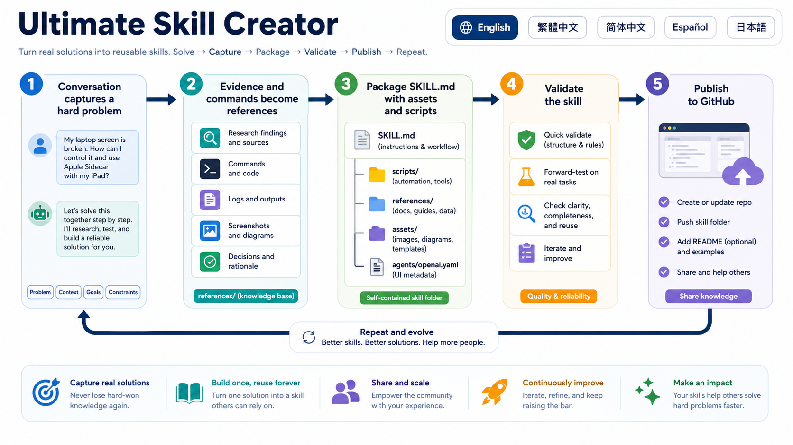

# Ultimate Skill Creator

Turn a solved user-agent workflow into a reusable skill package with a human-readable README, explicit safety boundaries, and separately reported validation evidence.

Language: [English](#english) | [繁體中文](#繁體中文) | [简体中文](#简体中文) | [Español](#español) | [日本語](#日本語) | [Português](#português) | [हिन्दी](#हिन्दी) | [العربية](#العربية)

## English

This is a Codex-oriented skill for extracting durable knowledge from conversations, troubleshooting, automation, and research. The installable entry point is [skill/ultimate-skill-creator/SKILL.md](skill/ultimate-skill-creator/SKILL.md). The repository uses singular `skill/`; new generated candidates use plural `skills/`.

The README workflow now follows a [versioned convention](skill/ultimate-skill-creator/references/universal-readme-spec.md) informed by a [dated review of 30 popular repositories](research/readme-study-2026-09-11.md). This is a project convention, not an official cross-agent README standard or proof that popularity means quality.

### Installation

In Codex, use the skill installer with the actual skill-directory URL:

```text
Use $skill-installer to install the skill from https://github.com/dev-james0723/ultimate-skill-creator/tree/main/skill/ultimate-skill-creator
```

Review the proposed destination before allowing installation. For manual local installation, copy the complete `skill/ultimate-skill-creator/` directory into a new `~/.agents/skills/ultimate-skill-creator/` directory. Do not replace an existing installation without reviewing the differences and approving the update. Codex's current [local skill documentation](https://developers.openai.com/codex/skills) describes discovery and restart behavior. Setup guidance was checked on 2026-09-11; a real Codex installation is not exercised by the Python tests here. This repository does not claim a marketplace listing.

### Quick start

After installation, ask Codex:

```text
Use $ultimate-skill-creator to package what we just solved into a reusable skill and a GitHub publication candidate. Include a README with a working example, expected output, compatibility, safety, validation, and limitations. Do not publish yet.
```

Expected output: a local candidate with `README.md`, `skills/<name>/SKILL.md`, references, relevant scripts/assets, an optional host adapter, and a report distinguishing completed checks from untested behavior. Review the actual workflow and license before publication.



### Usage

Use this skill when the important instructions, failed paths, corrections, and evidence are scattered across a long conversation. It extracts the reusable workflow rather than preserving private transcripts verbatim. It also helps revise an existing skill's README. It does not turn an untested idea into a proven solution merely by formatting it.

From this repository's root, create a draft skeleton:

```bash
python3 skill/ultimate-skill-creator/scripts/create_skill_candidate.py \
  --name "my-new-skill" \
  --out ./candidate \
  --title "My New Skill" \
  --languages "en,zh-Hant,zh-Hans,es,ja,pt,hi,ar"
```

The output directory must be new. Existing files, directories, and output symlinks are refused, even if a directory is empty. `--description` can supply a real purpose/trigger sentence. All original flags remain supported. The generator makes a draft, does not invent a license, and explicitly labels unfinished translations. Complete those sections or remove both the section and its language link before release.

The core loop is: capture goals and evidence, separate reusable instructions, package the skill, write the human README, validate at separate levels, then publish only within explicit authorization. Detailed instructions live in the [workflow reference](skill/ultimate-skill-creator/references/workflow.md).

### Compatibility

The generator, offline linter, and tests require Python 3.10 or later and use only the standard library. The operational skill targets Codex; `agents/openai.yaml` is a Codex adapter. The skill format follows [Agent Skills](https://agentskills.io/specification), but other hosts, tools, hooks, and publication integrations are not thereby guaranteed to work. Test the intended host separately.

Image generation and GitHub publication need separately available tools and permissions. Neither is required to generate or lint a local candidate. No API key is needed by the bundled Python scripts.

### Safety

The bundled generator and linter do not call the network, install dependencies, delete files, or publish to GitHub. The generator creates new candidate files and refuses an existing output path; it has no force-overwrite switch. The linter reads local files and does not execute examples.

Review third-party rights, secrets, private conversation details, screenshots, and machine-specific paths before packaging. File deletion, replacing existing work, external publication, and repository visibility changes require the relevant explicit permission. A scoped request to update a named repository does not authorize unrelated changes. See [GitHub publication safety](skill/ultimate-skill-creator/references/github-publication.md).

### Validation

Run the regression suite from the repository root:

```bash
python3 -m unittest discover -s tests -v
python3 skill/ultimate-skill-creator/scripts/validate_readme.py README.md --strict --json
```

For a generated draft, omit `--strict` initially:

```bash
python3 skill/ultimate-skill-creator/scripts/validate_readme.py ./candidate/README.md --json
```

Draft mode still rejects structural errors and broken supported local links. Strict mode also rejects unresolved draft markers. Neither mode certifies semantic completeness, translation accuracy, licensing, external URL availability, installation success, or skill behavior. Run a skill-format validator, shipped-script tests, and a representative host task separately; record skipped checks rather than claiming they passed.

The regression suite covers scaffold structure, existing-path protection, language anchors, quoting, invalid input, local links, path escapes, and CLI behavior. It uses disposable fixtures, not real accounts or publication actions.

### Troubleshooting

| Symptom | Cause and safe next step |
| --- | --- |
| Generator refuses the destination | Choose a new `--out` path. Do not delete existing work merely to retry. |
| Strict lint rejects a generated README | Finish the actual workflow documentation and translations; select the license. Draft generation is intentionally not release-ready. |
| A language or image link fails | Check the real anchor/file and its relative path. Link only material that exists. |
| An unsupported locale is requested | Use one of the codes in the shared specification, or deliberately extend that specification and its tests. |
| A complex existing README produces a false finding | The offline linter implements a documented Markdown subset, not all GFM. Inspect GitHub preview and simplify or deliberately extend the unsupported construct. |
| Codex cannot discover the skill | Check the complete installed directory and current host documentation; restart if changes do not appear. Avoid duplicate installations. |

Updating means reviewing and applying a scoped diff, not rerunning the candidate generator on an existing directory. To stop using an installed skill, disable it using the host's settings first; removal of local files remains a separate user-approved action.

### Included files

| File | Purpose |
| --- | --- |
| [SKILL.md](skill/ultimate-skill-creator/SKILL.md) | Action-oriented agent workflow and documentation review gates. |
| [Universal README convention](skill/ultimate-skill-creator/references/universal-readme-spec.md) | Core content, optional modules, style, and manual acceptance checks. |
| [Shared specification](skill/ultimate-skill-creator/assets/readme-spec.json) | Section labels, aliases, draft prompts, and supported language names. |
| [Generator](skill/ultimate-skill-creator/scripts/create_skill_candidate.py) | Create-only draft packaging helper. |
| [README linter](skill/ultimate-skill-creator/scripts/validate_readme.py) | Offline structural/link checks with draft and strict modes. |
| [Language guidance](skill/ultimate-skill-creator/references/language-and-readme.md) | Real language sections, stable anchors, translation status, and visual guidance. |
| [Research study](research/readme-study-2026-09-11.md) | Thirty source-by-source README observations and selection limits. |
| [Tests](tests/test_readme_workflow.py) | Regression tests for the generator and linter. |

The original guide image and [portable SVG](skill/ultimate-skill-creator/assets/skill-creation-loop.svg) remain available. Visuals are optional, not mandatory for every generated skill.

### Contributing

Open an issue or pull request with a reproducible example and the intended behavior. Keep the JSON specification, generator, documentation, and tests consistent. Include regression tests for changes to file safety, links, language handling, or CLI behavior. Avoid unrelated cleanup or assertions that a test passed without running it.

### License

This repository retains its [MIT license](LICENSE). That license does not automatically apply to a new candidate's user content or borrowed third-party material. The owner must select appropriate terms and preserve required attributions before publishing a candidate.

## 繁體中文

呢個 repo 係一套獨立嘅 Codex skill，目的係將「你同 AI 一齊解決咗一個真問題」呢個過程，打包成可重用、可驗證、可上 GitHub 嘅 skill。

適合用喺長對話入面有好多重要 instruction、失敗、修正同驗證，想將經驗變成 `SKILL.md`，再加 references、scripts、assets 同人類睇得明嘅 README。

新版加入 30 個熱門 repo 嘅 README 研究、通用文件規格、草稿 generator 同離線檢查器。規格分必需內容同按情況加入嘅章節，唔會硬塞長篇文案。Generator 唔會覆寫現有目錄；語言連結有實際對應章節，但未翻譯嘅內容會清楚標示為草稿。格式通過唔代表功能已驗證，發佈仍然需要明確授權。

安裝同指令見上面 [English](#english)。流程係回收目標同證據、整理工作步驟、建立套件、完成 README、分開驗證格式同實際功能，最後先喺授權範圍內發佈。

## 简体中文

这个 repo 是一套独立的 Codex skill，用来把你和 AI 一起解决问题的过程，打包成可复用、可验证、可上传 GitHub 的 skill。新版加入 30 个热门仓库的 README 研究、通用文档规范、拒绝覆盖已有目录的生成器和离线检查器。生成结果是草稿；格式检查不等于功能验证。完成内容、选择许可证并取得明确授权后才可发布。安装和命令见 [English](#english)。

## Español

Este repositorio contiene una skill para convertir una solución real en un paquete reutilizable. Incluye una convención de README basada en 30 repositorios, un generador que no reemplaza directorios existentes y un verificador local. El resultado generado es un borrador; verificar el formato no demuestra que la skill funcione. Publica únicamente con autorización explícita. Instalación y comandos: [English](#english).

## 日本語

解決済みの会話や作業を、再利用可能な skill にまとめるための Codex skill です。30 個のリポジトリを参考にした README 規約、既存ディレクトリを上書きしない生成ツール、オフライン検査を含みます。生成物は草稿です。形式の検査と実際の動作確認は別であり、公開には明示的な許可が必要です。インストールとコマンドは [English](#english) を参照してください。

## Português

Este repositório transforma uma solução real em uma skill reutilizável. Inclui uma convenção de README baseada em 30 repositórios, um gerador que não substitui diretórios existentes e uma verificação local. O resultado é um rascunho; verificar a estrutura não comprova o funcionamento. Publique apenas com autorização explícita. Instalação e comandos: [English](#english).

## हिन्दी

यह Codex skill हल किए गए कार्य को दोबारा उपयोग योग्य skill में बदलती है। इसमें 30 repositories के अध्ययन पर आधारित README नियम, मौजूदा directory को न बदलने वाला generator और offline जाँच शामिल हैं। तैयार सामग्री एक मसौदा है; संरचना की जाँच कार्यक्षमता का प्रमाण नहीं है। प्रकाशन से पहले स्पष्ट अनुमति लें। स्थापना और commands के लिए [English](#english) देखें।

## العربية

تساعد هذه المهارة على تحويل حل عملي إلى مهارة قابلة لإعادة الاستخدام. تتضمن قواعد README مبنية على دراسة 30 مستودعًا، ومولّدًا لا يستبدل المجلدات الموجودة، وفحصًا محليًا. الناتج مسودة؛ نجاح فحص البنية لا يثبت صحة التنفيذ. النشر يحتاج إلى موافقة صريحة. للتثبيت والأوامر، راجع [English](#english).
